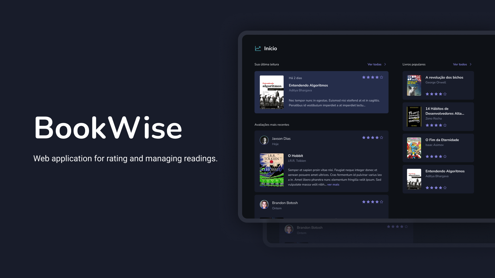

  

# BookWise

  
  
  

BookWise is an exquisitely designed web application that caters to book enthusiasts. With an intuitive interface and seamless functionality, BookWise empowers users to access a wealth of information, allowing users to get more information, rate and view another user's rating about books, using Google and GitHub OAuth2.

## 🚀 Features

1. **Book Information:** Access a wealth of details about books, including author, num ber of pages, genre, and more.

2. **User Ratings & Reviews:** Rate and review books to share opinions and help others discover great reads.

3. **Intuitive Interface:** Enjoy an exquisitely designed, user-friendly layout for effortless navigation and interaction.

4. **OAuth2 Integration:** Sign in securely with Google and GitHub accounts, no need to create a new one.

 

## 🛠️ Technologies

This application is built using the following technologies:

- [NextJS](https://nextjs.org/)
- [NextAuth.js](https://next-auth.js.org/)
- [React](https://reactjs.org/)
- [TypeScript](https://www.typescriptlang.org/)
- [TailwindCSS](https://tailwindcss.com/)
- [Google OAuth2](https://developers.google.com/identity/protocols/oauth2)
- [GitHub OAuth2]([https://developers.google.com/identity/protocols/oauth2](https://docs.github.com/en/apps/oauth-apps/building-oauth-apps/authorizing-oauth-apps))

 

## 🚀 Getting Started

Follow these steps to get started with the Application:

1. Clone the repository to your local machine.

2. Install dependencies using the command `npm install`.

3. Create a .env file with the .env.example file structure with your own values.

4. With an available Postgres DB, run Prisma migrations using the command `npx prisma migrate dev`.

5. Run Prisma seeds using the command `npx prisma db seed`.

6. Start the development server using the command `npm run dev`.

7. In your browser, navigate to `http://localhost:3000` to access the application.

 

## 🚀 Creating a Production Build

To create a production build of the Timer Application, follow these steps:

1. Run the command `npm run build`.

2. Run `npm start` to run `.next` build file

 

## 🤝 Contributing

Contributions to this project are welcome. To contribute, follow these steps:

1. Fork the repository.

2. Create a new branch.

3. Make your changes and commit them.

4. Push to the new branch.

5. Create a pull request.

 

## 📝 License

This project is licensed under the MIT License.
